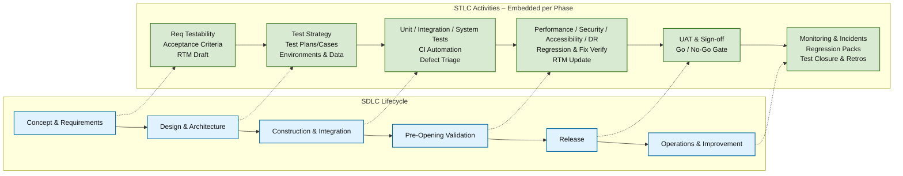
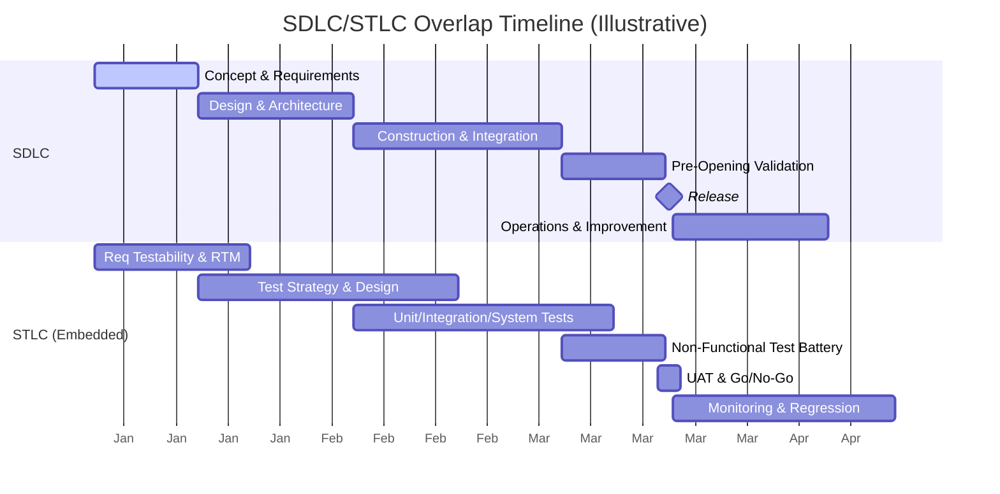
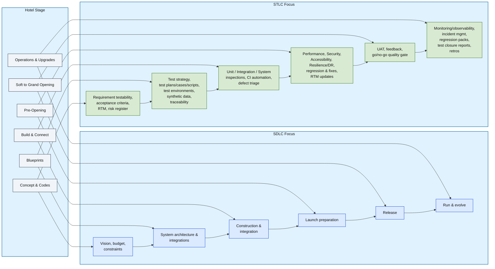

# SDLC vs STLC — Luxury Hotel You Design, Build, Open, and Operate

---

## Table of Contents

* [Core Idea](#core-idea)
* [Phase Mapping (Hotel Analogy)](#phase-mapping-hotel-analogy)
* [Diagram 1 — Embedded STLC Across SDLC (Flowchart)](#diagram-1--embedded-stlc-across-sdlc-flowchart)
* [Diagram 2 — SDLC/STLC Overlap Timeline (Gantt)](#diagram-2--sdlcstlc-overlap-timeline-gantt)
* [Workflows & Artifacts (STLC by Phase)](#workflows--artifacts-stlc-by-phase)
* [How to Use This in a Post](#how-to-use-this-in-a-post)

---

## Core Idea

**SDLC** covers the *entire* lifecycle of the hotel (from site selection to daily operations and renovations). **STLC** is the *embedded quality discipline* that spans the lifecycle—planning, inspecting, testing, and monitoring every system *before, during, and after* opening.

> This framing aligns with modern Agile/DevOps practices (iterative testing, CI/CD, observability). In traditional waterfall, STLC activities may appear more sequential, but they still map to the same phases.

---

## Phase Mapping (Hotel Analogy)

| Hotel Stage           | SDLC Focus                         | STLC Focus                                                                                             |
| --------------------- | ---------------------------------- | ------------------------------------------------------------------------------------------------------ |
| Concept & Codes       | Vision, budget, constraints        | Requirement testability, acceptance criteria, **Requirement Traceability Matrix (RTM)**, risk register |
| Blueprints            | System architecture & integrations | Test strategy, test plans/cases/scripts, test environments, **synthetic data**, traceability           |
| Build & Connect       | Construction & integration         | **Unit / Integration / System** inspections, CI automation, defect triage                              |
| Pre‑Opening           | Launch preparation                 | **Performance, Security, Accessibility, Resilience/DR**, regression & fixes, RTM updates               |
| Soft → Grand Opening  | Release                            | UAT, feedback, **go/no‑go quality gate**                                                               |
| Operations & Upgrades | Run & evolve                       | Monitoring/observability, incident mgmt, regression packs, **test closure reports**, retros            |

---

## Diagram 1 — Embedded STLC Across SDLC (Flowchart)

**How to read this:** SDLC forms the main spine. At each phase, STLC has a dedicated, structured set of activities that begin early (shift‑left), continue through delivery, and persist in operations.

---

## Diagram 2 — SDLC/STLC Overlap Timeline (Gantt)

**How to read this:** STLC doesn’t start “after coding.” It overlaps *from day one* (testability/RTM), crescendos through construction and validation, and continues into operations (monitoring, regression).

---

## Workflows & Artifacts (STLC by Phase)

**Requirements (Shift‑Left)**

* RTM (requirements ↔ tests), acceptance criteria, risk register

**Design**

* Test strategy, test plan, test cases/scripts, environment & data plan

**Build/Integrate**

* Unit/Integration/System suites, CI pipelines, defect lifecycle (open → triage → fix → verify → close)

**Pre‑Opening**

* Performance (load/stress), security (pen‑test), accessibility (WCAG/ADA), resilience/DR; regression packs; RTM updates

**Release**

* UAT reports, exit criteria, go/no‑go quality gate

**Operations**

* Observability (logs/metrics/traces), incident management, post‑release regression, **test closure reports** & retrospectives

---

## How to Use This in a Post

* Copy the diagrams directly into your README or blog (GitHub renders Mermaid).
* For LinkedIn or slides, paste the code into a Mermaid editor to export images, then share with your commentary:

  * “STLC isn’t a phase; it’s the embedded quality discipline across SDLC. Shift‑left + monitor‑right.”

> Tip: Pair Diagram 1 (flow of work) with Diagram 2 (time overlap) to drive home *both* structure and chronology.

---

## Diagram 3 — Hotel Analogy Workflow (Three-Column Map)

